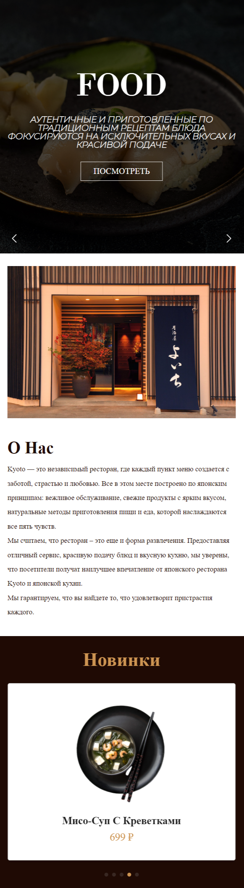
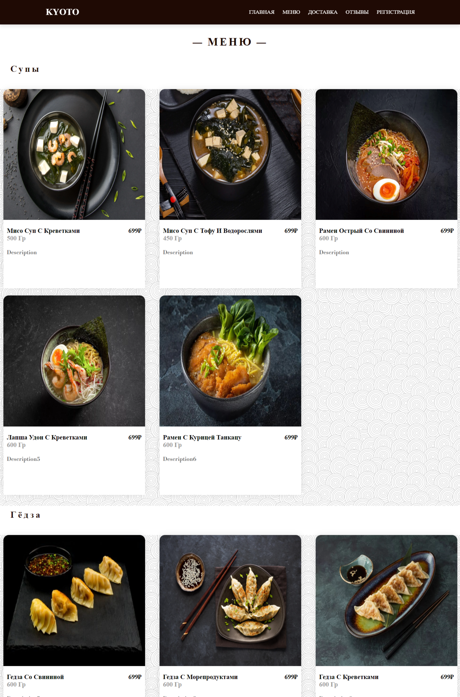
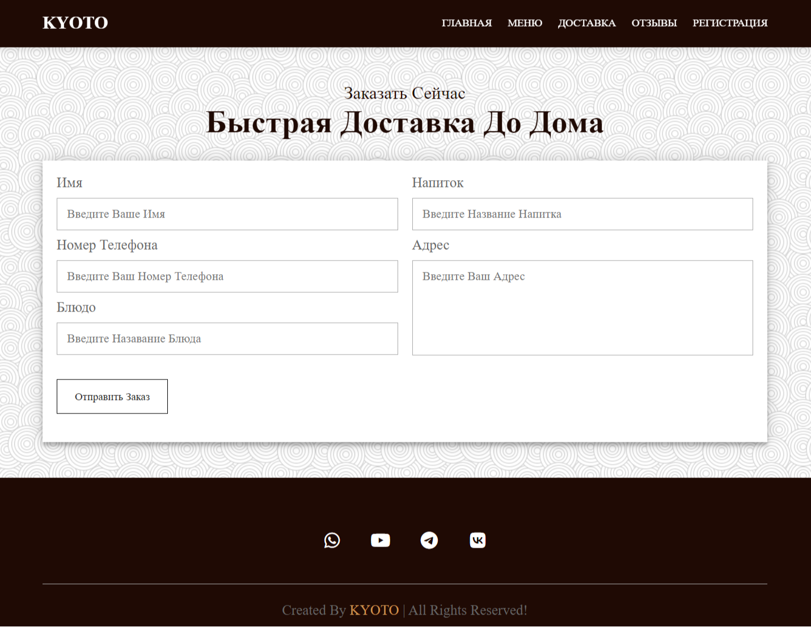
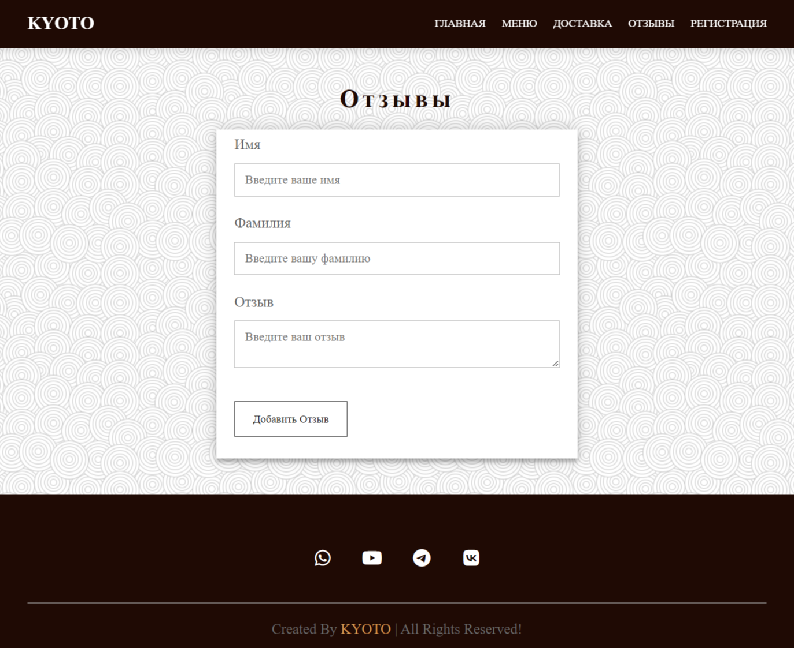
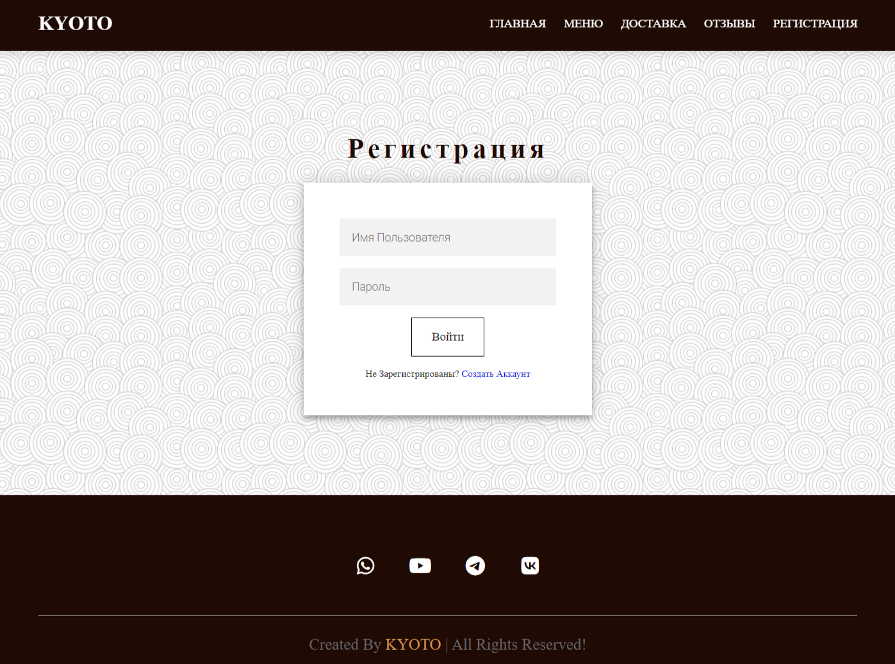
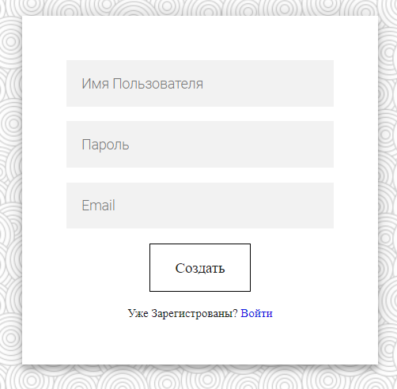
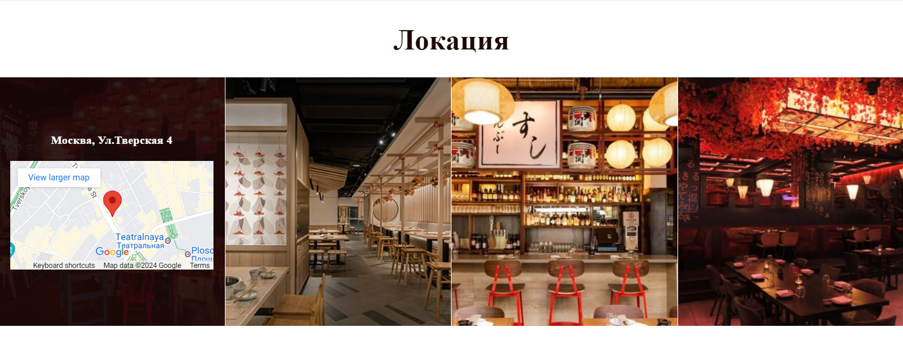

## Multi-page responsive restaurant website (frontend)

---

#### windows:

**main page**

---

---

**menu page**

**delivery and order page**     

      

**sign in and log in page**

 

__location part__

---

## Tools
* VScode
*  HTML
* CSS
* JavaScript
